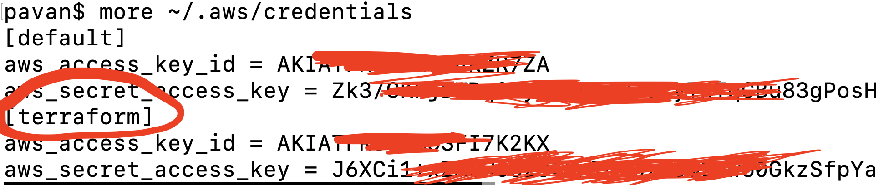

What's this:
=========

This is to set up wordpress using AWS infrastructure. We are using terraform to provision infrastructure. Code uses and creates following aws services.

1. VPC and it's components
2. Subnets, Route Tables, Internet Gateway, Nat Gateway.
3. EC2 instance
4. EIP for NAT Gateway
5. RDS mysql instance.
6. Security Groups to access both EC2 and MYSQL

Note:  
-----
You may get charged by aws for using services

### Pre-requisite:

   1. You need to have Ssh keys generated and should be put into `~/.ssh/` , if your machine is windows then feel free to use diff path and update the same in the `ssh_key` variable in the `vars.tf`

   2. create an IAM user and create security credentials(AccessKey, SecretKey) and update in the `~/.aws/credentials` file like below
   
   
   __Note__ : if you have default profile, just erase the `profile` attribute in `provider.tf`

Usage:
=======

provisioning:
-------------

1. git clone https://github.com/aleti-pavan/terraform-aws-wordpress.git
2. cd terraform-aws-wordpress
2. terraform init
3. terraform plan
4. terraform apply -auto-approve

Destroying the Infra:
---------------------
1. cd terraform-aws-wordpress (Be in the repo directory)
2. terraform destroy -auto-approve

Change: (latest detail from top)
------ 

Code has been changed on 11th April, 2020. Code is now compatible with below versions.

Versions:
--------
Terraform v0.12.24
+ provider.aws v2.12.0
+ provider.template v2.1.2

__(Old)__ Code slightly changed on 31st May, 2019. 
I have added providers.tf with versions required for each provider